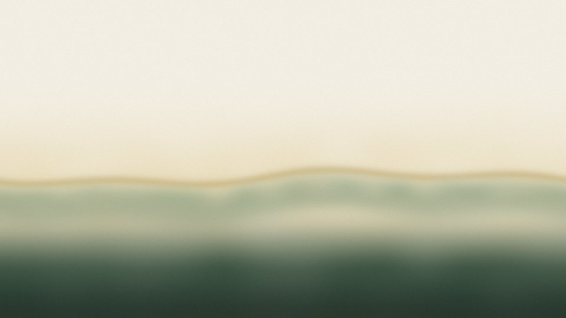
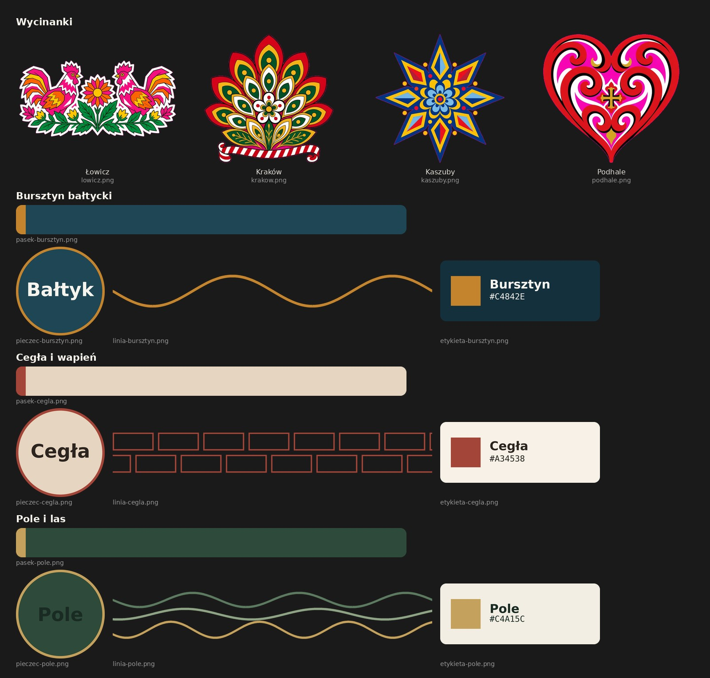

# Polskie palety (polish-palettes)

Polski odpowiednik Norda: trzy schematy i nic więcej. Nie flaga, nie wycinanka łowicka. Zasada użycia to 70% tła, 20% powierzchni, 10% akcentu. Akcent nie idzie na duże płaszczyzny.

KDE Plasma 6 jest pierwszym celem, nie nazwą produktu. W tym repozytorium są schematy kolorów Plasma, tapety, Konsole, Kate i motyw globalny (look-and-feel).

Później, bez plików tutaj: GTK, Firefox, edytory spoza Kate, inne terminale. Dopóki nie ma osobnej implementacji, nie dokładamy atrap.

## Podgląd

Tapety 3840×2160, zmniejszone do podglądu. Pełne pliki są w `wallpapers/`.




## Dekale

Geometria korzysta z palety; Łowicz, Kraków, Kaszuby i Podhale to osobne naklejki, nie system kolorów.



- `decals/lowicz.png`
- `decals/krakow.png`
- `decals/kaszuby.png`
- `decals/podhale.png`


## Bursztyn bałtycki

Ciemny. Morze w tle, bursztyn tylko jako akcent.

| Rola | Hex | RGB |
| --- | --- | --- |
| woda nocą / tło | #14303C | 20,48,60 |
| głęboka / panel | #1E4654 | 30,70,84 |
| bałtyk / podświetlenie | #3E6B78 | 62,107,120 |
| piana / przygaszony | #D5E3E4 | 213,227,228 |
| piasek | #EFE6D2 | 239,230,210 |
| jasny bursztyn | #E4C98A | 228,201,138 |
| bursztyn / akcent | #C4842E | 196,132,46 |
| ciemny bursztyn | #7A431C | 122,67,28 |
| tekst | #F7F4EE | 247,244,238 |

Korekta tylko roli zaznaczenia (poza paletą, bo żaden hex palety nie dawał 4.5:1 na bursztynie): `Colors:Selection` / `ForegroundNormal` `#14303C` → `#132D38` (19,45,56). Reszta schematu bez zmian.

## Cegła i wapień

Jasny. Tynk, piaskowiec, cegła gotycka, dąb.

| Rola | Hex | RGB |
| --- | --- | --- |
| tynk / tło | #F7F1E7 | 247,241,231 |
| wapień / powierzchnia | #E6D5C0 | 230,213,192 |
| piaskowiec / sidebar | #C9AE8C | 201,174,140 |
| cegła / akcent | #A34538 | 163,69,56 |
| cegła wypalona | #6E2F2A | 110,47,42 |
| dąb | #5C4032 | 92,64,50 |
| węgiel / tekst | #2C241E | 44,36,30 |
| tekst na ciemnym | #F4EFE8 | 244,239,232 |

Bez korekt. Wszystkie sprawdzone pary tekstu przechodzą WCAG AA na hexach palety.

## Pole i las

Jasne okna, ciemny panel. Len, żyto, łąka, sosna. Bez jaskrawej zieleni.

| Rola | Hex | RGB |
| --- | --- | --- |
| len / tło | #F3EEE3 | 243,238,227 |
| pszenica | #E6D7AE | 230,215,174 |
| żyto / akcent | #C4A15C | 196,161,92 |
| szałwia | #8EA384 | 142,163,132 |
| łąka / zaznaczenie | #5C7A60 | 92,122,96 |
| las / panel | #2E4A3A | 46,74,58 |
| sosna / tekst | #1A2B24 | 26,43,36 |
| kora | #3E342A | 62,52,42 |

Korekta tylko roli zaznaczenia: `Colors:Selection` / `ForegroundNormal` `#F3EEE3` → `#FBF9F5` (251,249,245). Tło zaznaczenia zostaje łąką `#5C7A60`. Żaden hex palety nie miał 4.5:1 na tej łące.

## Kontrast

Liczone względną luminancją WCAG. Próg 4.5:1 dla zwykłego tekstu (`ForegroundNormal`, tytuł aktywnego okna). Próg 3:1 dla `ForegroundInactive` i nieaktywnego tytułu okna. Pary: View, Window, Button, Tooltip, Complementary — tekst zwykły i nieaktywny na ich `BackgroundNormal`; zaznaczenie — `ForegroundNormal` na `BackgroundNormal`; WM aktywne i nieaktywne.

Gdzie nic nie ruszano, „po” = „przed”.

| Schemat | Para | Próg | Przed | Po |
| --- | --- | --- | --- | --- |
| Bursztyn | View/Window/Tooltip/Complementary, tekst zwykły `#F7F4EE` na `#14303C` | 4.5 | 12.60 pass | bez zmian |
| Bursztyn | te same, nieaktywny `#D5E3E4` | 3.0 | 10.50 pass | bez zmian |
| Bursztyn | Button, tekst zwykły na `#1E4654` | 4.5 | 9.29 pass | bez zmian |
| Bursztyn | Button, nieaktywny na `#1E4654` | 3.0 | 7.74 pass | bez zmian |
| Bursztyn | Zaznaczenie `#14303C` → `#132D38` na `#C4842E` | 4.5 | 4.41 fail | 4.58 pass |
| Bursztyn | WM aktywne `#F7F4EE` na `#1E4654` | 4.5 | 9.29 pass | bez zmian |
| Bursztyn | WM nieaktywne `#D5E3E4` na `#14303C` | 3.0 | 10.50 pass | bez zmian |
| Cegła | View/Window/Tooltip, tekst `#2C241E` na `#F7F1E7` | 4.5 | 13.56 pass | bez zmian |
| Cegła | te same, nieaktywny `#5C4032` | 3.0 | 8.36 pass | bez zmian |
| Cegła | Button `#2C241E` / nieaktywny na `#E6D5C0` | 4.5 / 3.0 | 10.63 / 6.55 pass | bez zmian |
| Cegła | Complementary `#F4EFE8` / `#C9AE8C` na `#2C241E` | 4.5 / 3.0 | 13.32 / 7.20 pass | bez zmian |
| Cegła | Zaznaczenie `#F7F1E7` na `#A34538` | 4.5 | 5.39 pass | bez zmian |
| Cegła | WM aktywne na `#E6D5C0`, nieaktywne `#5C4032` na `#F7F1E7` | 4.5 / 3.0 | 10.63 / 8.36 pass | bez zmian |
| Pole | View/Window/Button/Tooltip `#1A2B24` na `#F3EEE3` | 4.5 | 12.83 pass | bez zmian |
| Pole | te same, nieaktywny `#3E342A` | 3.0 | 10.49 pass | bez zmian |
| Pole | Complementary `#F3EEE3` / `#8EA384` na `#2E4A3A` | 4.5 / 3.0 | 8.42 / 3.58 pass | bez zmian |
| Pole | Zaznaczenie `#F3EEE3` → `#FBF9F5` na `#5C7A60` | 4.5 | 4.12 fail | 4.53 pass |
| Pole | WM aktywne `#1A2B24` na `#F3EEE3` | 4.5 | 12.83 pass | bez zmian |
| Pole | WM nieaktywne `#3E342A` na `#E6D7AE` | 3.0 | 8.50 pass | bez zmian |

Poza tą listą, celowo nietknięte: pozostałe kolory tekstu zaznaczenia (Link, Active, Positive i reszta) nadal mają stary hex i ten sam brak 4.5:1. Akcent bursztynu `#C4842E` na wodzie `#14303C` ma 4.41:1; to nie jest `ForegroundNormal` (tam jest `#F7F4EE`). Nie rozjaśniano całego schematu.

W Kate tekst składni jest tylko z hexów, które mają 4.5:1 na tle edytora. Dlatego w „Pole i las” żyto `#C4A15C` zostaje akcentem dekoracji, a nie kolorem tekstu na lnie (tam ma 2.11:1). Zaznaczenie w Kate dla tego schematu to las `#2E4A3A`, nie łąka.

## Instalacja

Jednym ruchem:

```bash
./install.sh
```

Skrypt kopiuje do `~/.local/share/` (albo `$XDG_DATA_HOME`):

| Co | Dokąd |
| --- | --- |
| `color-schemes/*.colors` | `color-schemes/` |
| `konsole/*.colorscheme` | `konsole/` |
| `kate/*.theme` | `org.kde.syntax-highlighting/themes/` |
| `look-and-feel/*` | `plasma/look-and-feel/` |
| `wallpapers/*` | `wallpapers/` |

Ręcznie, sam schemat kolorów:

```bash
mkdir -p ~/.local/share/color-schemes
cp color-schemes/*.colors ~/.local/share/color-schemes/
plasma-apply-colorscheme BursztynBaltycki
plasma-apply-colorscheme CeglaWapien
plasma-apply-colorscheme PoleLas
```

Albo Ustawienia systemowe → Kolory. Identyfikator to pole `ColorScheme` w pliku, wszędzie w ASCII (`BursztynBaltycki`, jak w Konsole, Kate, tapecie i motywie globalnym).

Kto zastosował wcześniej schemat `BursztynBałtycki` (ze znakiem ł), musi po instalacji wybrać „Bursztyn bałtycki” ponownie; stary plik `~/.local/share/color-schemes/BursztynBałtycki.colors` można usunąć.

Tapety to paczki Plasma (`KPackageStructure`: `Plasma/Wallpaper`), obraz `contents/images/3840x2160.png`, bez tekstu, tylko z hexów danego schematu. Podgląd w `contents/screenshot.png` jest zmniejszeniem tej samej tapety, nie zrzutem pulpitu.

```bash
plasma-apply-wallpaperimage ~/.local/share/wallpapers/BursztynBaltycki/contents/images/3840x2160.png
plasma-apply-wallpaperimage ~/.local/share/wallpapers/CeglaWapien/contents/images/3840x2160.png
plasma-apply-wallpaperimage ~/.local/share/wallpapers/PoleLas/contents/images/3840x2160.png
```

Konsole, format z bieżącego mastera (sekcje `[Background]`, `[Color0]`…`[Color7]` plus Faint/Intense, `[General]` z `Description`, `Opacity`, `Blur`):

```bash
mkdir -p ~/.local/share/konsole
cp konsole/*.colorscheme ~/.local/share/konsole/
```

Potem profil → Wygląd. Nazwy: „Bursztyn bałtycki”, „Cegła i wapień”, „Pole i las”. Kolory ANSI są tymi samymi hexami, nie osobną paletą terminala, więc część slotów (czerń, przygaszone złoto) nie ma 4.5:1. Zwykły tekst na tle przechodzi.

Kate, JSON KSyntaxHighlighting (nie stary katepart schema). Od Frameworks 5.75 katalog `katepart5` jest przestarzały; pliki `.theme` lądują tutaj:

```bash
mkdir -p ~/.local/share/org.kde.syntax-highlighting/themes
cp kate/*.theme ~/.local/share/org.kde.syntax-highlighting/themes/
```

Ustawienia → Konfiguruj Kate → Motywy kolorów. Flatpak trzyma dane w `~/.var/app/org.kde.kate/data/org.kde.syntax-highlighting/themes/`.

Motyw globalny: Plasma 6 wymaga `metadata.json` z `"KPackageStructure": "Plasma/LookAndFeel"`. `metadata.desktop` jest obok, dla starszych narzędzi. `contents/defaults` ustawia `ColorScheme` na nazwę schematu, styl widgetów Breeze, dekorację okien Breeze i tapetę. Własnego motywu ikon nie ma: zostają ikony Breeze (`breeze` albo, przy bursztynie, `breeze-dark`). Akcent to akcent schematu, nie podmieniony zestaw ikon. Brakujące części spadają na Breeze (`X-KDE-fallbackPackage`).

```bash
plasma-apply-lookandfeel --apply pl.palety.bursztyn-baltycki
plasma-apply-lookandfeel --apply pl.palety.cegla-wapien
plasma-apply-lookandfeel --apply pl.palety.pole-las
```

## Czego tu nie ma

Świadomie, względem kompletu w stylu Norda:

- własna dekoracja okien Aurorae — zostaje Breeze
- własny motyw ikon i kursorów — zostaje Breeze
- układ panelu — nie narzucamy skryptu layoutu
- zrzuty pulpitu — tego środowiska tu nie ma
- wpis na store.kde.org — następny krok to metadane KNewStuff, bez publikacji z tego repozytorium

## Drzewo plików

```
.
├── install.sh
├── README.md
├── PROMPT.md
├── color-schemes/
│   ├── BursztynBaltycki.colors
│   ├── CeglaWapien.colors
│   └── PoleLas.colors
├── konsole/
│   ├── BursztynBaltycki.colorscheme
│   ├── CeglaWapien.colorscheme
│   └── PoleLas.colorscheme
├── kate/
│   ├── BursztynBaltycki.theme
│   ├── CeglaWapien.theme
│   └── PoleLas.theme
├── look-and-feel/
│   ├── pl.palety.bursztyn-baltycki/
│   │   ├── metadata.json
│   │   ├── metadata.desktop
│   │   └── contents/defaults
│   ├── pl.palety.cegla-wapien/
│   └── pl.palety.pole-las/
└── wallpapers/
    ├── BursztynBaltycki/
    │   ├── metadata.json
    │   └── contents/images/3840x2160.png
    ├── CeglaWapien/
    └── PoleLas/
```
